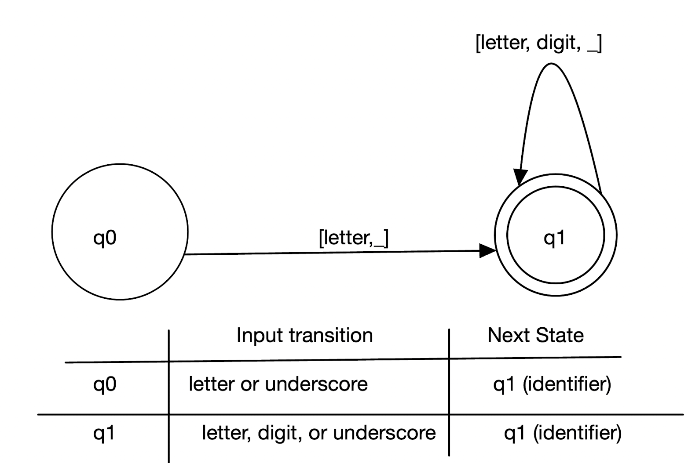
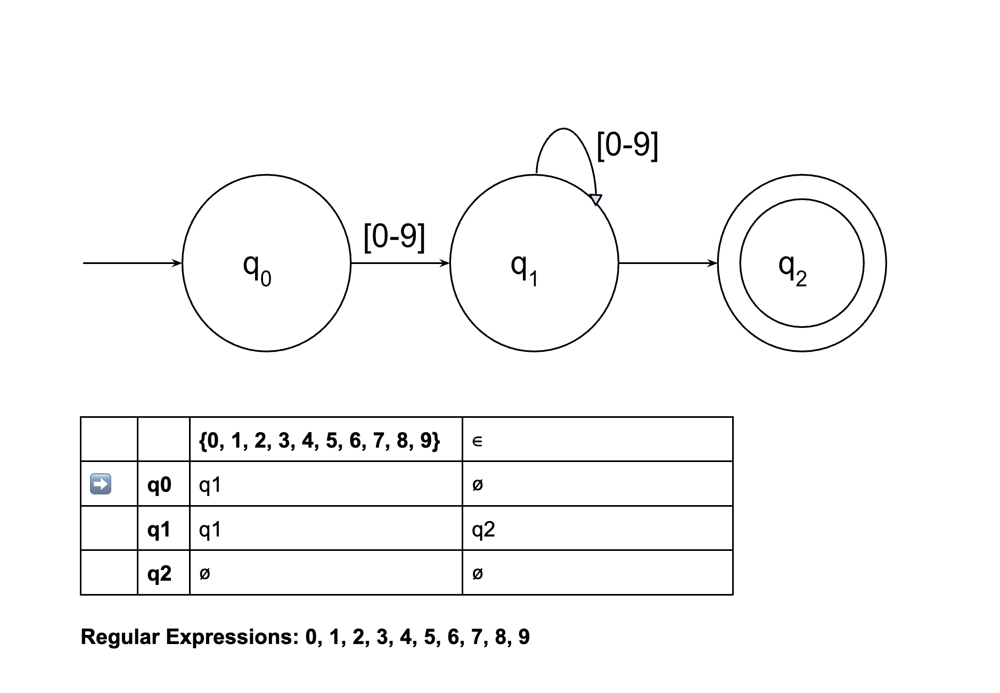

# Lexical Analyzer (Lexer)
## Contributors

| Name            | Link to GitHub Account                  |
|-----------------|-----------------------------------------|
| Guido Asbun     | [GitHub](https://github.com/guidoasbun) |
| Cade Duncan     | [GitHub](https://github.com/Stingrayss) |
| Briyana Verdugo | [GitHub](https://github.com/B-T-V)      |

## Link to GitHub Repository
[GitHub Repository](https://github.com/guidoasbun/CPSC-323-group-project-1-lexer)

## Links to files
1. [View the code](src)
2. [View the test input file - input_scode.txt](src/InputOutputFiles/input_scode.txt)
3. [View the test output file - output_scode.txt](src/InputOutputFiles/output_scode.txt)
4. [View the Design Document - FSA_mydesign.doc](DesignFile/FSA_mydesign.pdf)
5. [View the Read me file (you are already on the Readme)](README.md)

## Description
- This program is a lexical analyzer (lexer) that reads in text (code) from a file then tokenizes the text into a list of tokens and lexemes. The program then outputs the list of tokens and lexemes to a file.
- This Lexer analyzer also ignores comments and whitespace.
- This program is written and tested in Java using Oracle JDk version 21
- The main logic of the program is in the 'TokenLexemeParser' class.
- The 'Main' class is used to run the program and test the 'TokenLexemeParser' class.
- The 'Token' class is used to create a token object that holds the token and lexeme of a word in the input file.
  - We used a Java Regular Expression to match the tokens and lexemes in the input file.

## How to run
- Make you have the latest version of Oracle Java 21 installed on your machine.
- Clone the repository to your local machine.
- Open the project in your favorite IDE (IntelliJ, VS-Code, etc.)
- On line 17 and 18 of the `Main.java` file, change the `inputFile` and `outputFile` variables to the path of the file you want to read from and the path of the file you want to write to.
- Run the program.

## FSA for tokens

### Identifier:

---
### Integer:

---